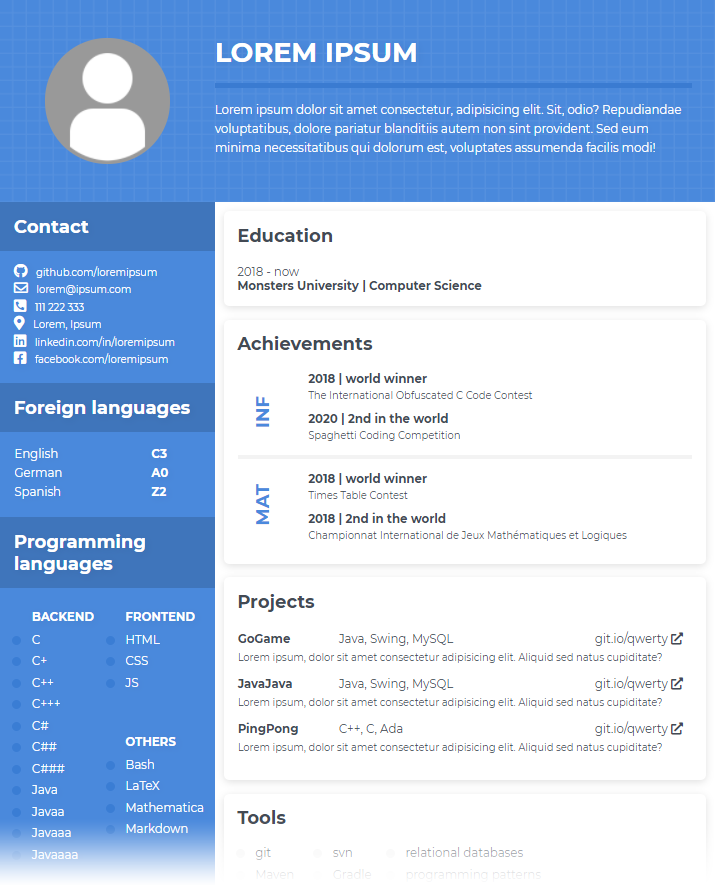
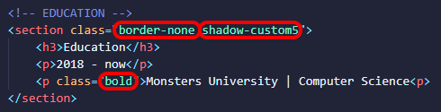

# Resume & CV from HTML

## Table of Contents
- [About The Project](#about-the-project)
- [Why Resume&CV?](#why-resumecv)
- [How To Use It?](#how-to-use-it)
- [For Frontend Geeks](#for-frontend-geeks)
- [For rest of the Population](#for-rest-of-the-population)
- [Contribution](#contribution)

## About The Project
**Resume&CV** is a simple tool for generating PDF document based on HTML/CSS templates. Take advantage of using one of many [templates](/templates) and stylize it with predefined CSS [styles](/css) or make your own. Currently you can find ready-to-use CSS class for
[backgrounds](/css/backgrounds.css),
[borders](/css/borders.css),
[shadows](/css/shadows.css),
[colors](/css/colors.css),
[fonts](/css/fonts.css),
[lists & tables](/css/lists_tables.css),
[sections](/css/sections.css),
[pages](/css/pages.css).  
  

## Why Resume&CV?
It's **simple**. CSS is the easiest way to stylize your document to be **pleasing to eye**. Moreover, conversion to PDF from HTML **keeps your hyperlinks**, so your final CV can be a bit more interactive.  
  

## How To Use It?
Find the best CV/resume HTML template inside [templates](/templates) directory. Then replace LoremIpsum fields to your own data. Template design is based on CSS classes, so all you have to do is change one class to another. Then if your CV is ready, open template file in your local browser. You should see something similar to the picture at the top of the page. Right click on the page and select `Print` option (or simply press `CTR + P`). Then, inside printing menu change some options to the ones below and press `Save`. Voilà!
- [X] Destination PDF
- [ ] Margins
- [x] Background graphics

**Attention!** Take care that your data fit into single page. If not, add new section with `pageA4` class or use one of multi-page templates.  

## For Frontend Geeks
You know how to HTML? Then you shouldn't have any problems with preparing your own CV.
Customize your page elements with predefined [css](/css) files. You can always create your own amazing style/template and add your work to Resume&CV project. Thank you!

## For rest of the Population
Basically, you can prepare your CV with only changing LoremIpsum fields to your own data. This doesn't require you to dive deep into HTML. But if you have some free time, you can read about HTML tags most often used in our templates: 
[\<div\>](https://developer.mozilla.org/en-US/docs/Web/HTML/Element/div), 
[\<p\>](https://developer.mozilla.org/en-US/docs/Web/HTML/Element/p),
[\<h1\>-\<h6\>](https://developer.mozilla.org/en-US/docs/Web/HTML/Element/Heading_Elements),
[\<ul\>](https://developer.mozilla.org/en-US/docs/Web/HTML/Element/ul),
[\<table\>](https://developer.mozilla.org/en-US/docs/Web/HTML/Element/table),
[\](https://developer.mozilla.org/en-US/docs/Web/HTML/Element/img).

## Contribution
Wanna contribute? Have idea for new amazing template or style?
Let's do this! Fork the project and add something from yourself. There is only one rule - keep project simple, so that anyone even without HTML experience can use it in the future.
